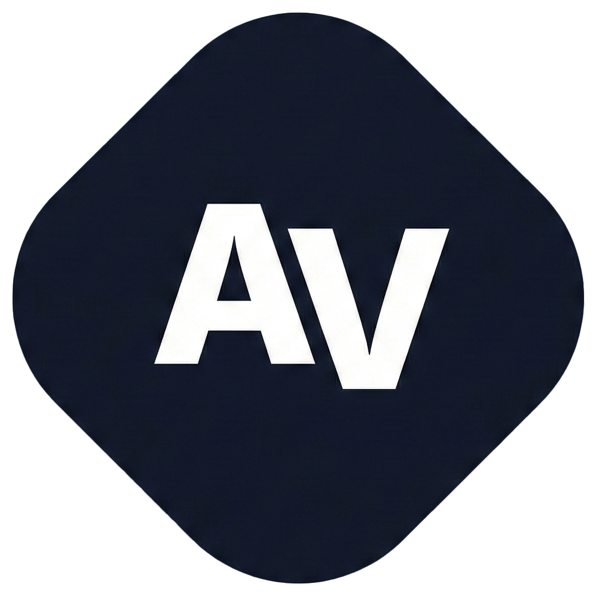

#  Alexander-Vickery.github.io


This repository contains the source code for my [personal portfolio website](https://www.alexander-vickery.com).

## Devlopment Stack

* **Framework/Tooling:** [Vite](https://vitejs.dev/).
* **Language:** [TypeScript](https://www.typescriptlang.org/).
* **Markup:** [HTML5](https://www.w3docs.com/learn-html/html5-introduction.html).
* **Deployment:** [Vercel](https://vercel.com).
* **Styling:** [Tailwind CSS](https://tailwindcss.com/).

## Getting Started

If you want to run this project locally on your machine, follow these steps:

### Prerequisites

Make sure you have [Node.js](https://nodejs.org/) installed on your machine.

### Installation

1.  **Clone the repository**
    ```bash
    git clone https://github.com/Alex-Vickery/alexander-vickery.github.io.git
    cd alexander-vickery.github.io
    ```

2.  **Install dependencies**
    ```bash
    npm install
    # or if you use yarn
    yarn
    ```

3.  **Run the development server**
    ```bash
    npm run dev
    ```
    Open http://localhost:5173 (or the port shown in your terminal) to view it in the browser.

4.  **Build for production**
    ```bash
    npm run build
    ```

## Using this Template

If you would like to use this code as a starting point for your own portfolio, you are welcome to do so! 

**Please follow these steps to make it your own:**

1.  **Fork** or **Clone** the repo.
2.  **Update Content:** Please replace all personal information, project descriptions, and images with your own.

## License

This work is licensed under a **Creative Commons Attribution-NonCommercial-ShareAlike 4.0 International License**.

You are free to:
* **Share** - copy and redistribute the material in any medium or format.
* **Adapt** - remix, transform, and build upon the material.

To view a copy of this license, visit http://creativecommons.org/licenses/by-nc-sa/4.0/.

---

Alexander Vickery 


